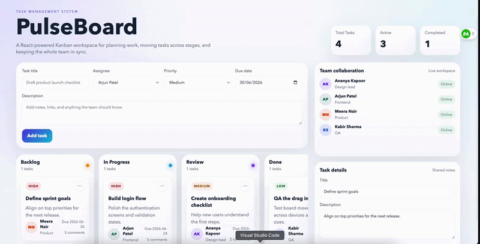

# PulseBoard

PulseBoard is a React-based task management system built with Create React App. It gives you a Trello-style Kanban workspace for organizing work, dragging tasks between stages, and keeping a team aligned in one place.

## Features

- Kanban board layout with four workflow columns:
  - Backlog
  - In Progress
  - Review
  - Done
- Drag-and-drop task movement between columns
- Create new tasks from the composer form
- Edit task details directly in the task details panel
- Team collaboration sidebar with member profiles
- Live activity feed showing recent task actions
- Priority labels for high, medium, and low urgency work
- Due dates and comment counts for each task
- Local persistence with `localStorage` so your board state stays after refresh
- Responsive layout for desktop and smaller screens

## Demo Video




## Tech Stack

- React 18
- Create React App
- Plain CSS for styling
- Native HTML drag-and-drop APIs

## Project Structure

```text
task-management-system/
├── public/
│   └── index.html
├── src/
│   ├── App.jsx
│   ├── index.js
│   └── styles.css
├── .env
├── package.json
└── README.md
```

## How to Run

### 1. Install dependencies

From the project folder:

```bash
cd /Users/vishalshivakumarkanakamamidi/Desktop/ajproj/task-management-system
npm install
```

### 2. Start the development server

```bash
npm start
```

The app will open in your browser on the local CRA dev server.

## Build for Production

To create a production-ready build:

```bash
npm run build
```

The compiled files will be placed in the `build/` folder.

## Notes

- The board saves its state in your browser using `localStorage`.
- If you want to reset the saved board data, clear the site data in your browser or remove the `taskflow-board-v1` entry from `localStorage`.
- Fast Refresh is disabled through `.env` for better compatibility in this environment.

## Available Scripts

In the project directory, you can run:

- `npm start` - starts the development server
- `npm run build` - builds the app for production
- `npm test` - starts the test runner
